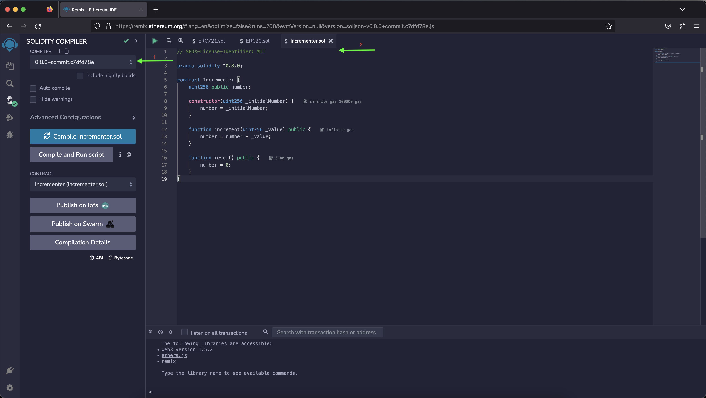
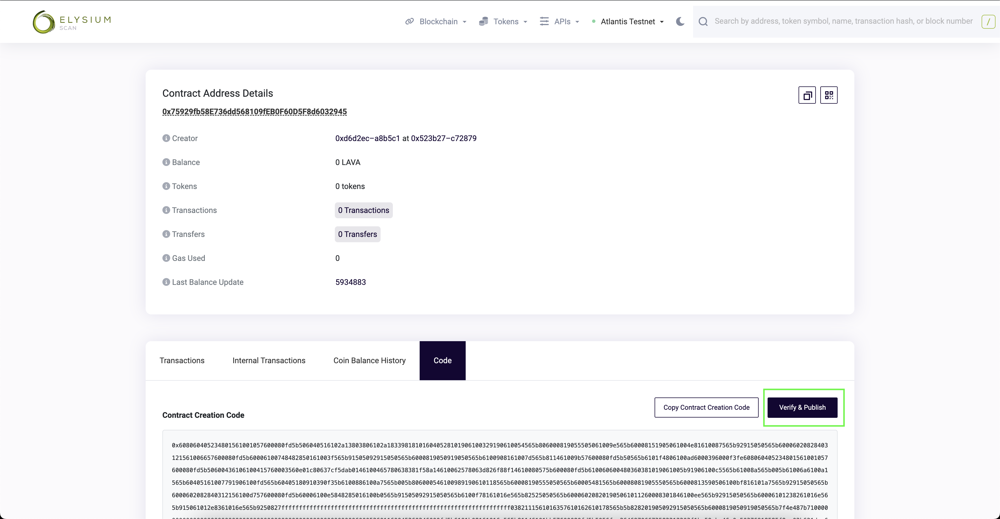
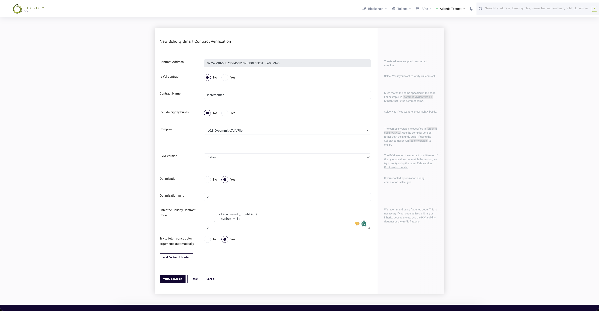
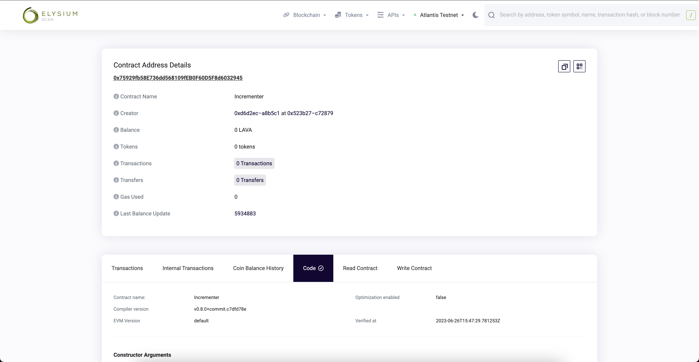

# Verify Smart Contracts using Block Explorers

Verifying smart contracts on a block explorer is a great way of improving the transparency and security of deployed
smart contracts on Elysium. Users can directly view the source code for verified smart contracts, and for some block
explorers, can also directly interact with the contract's public methods through the block explorer's interface.

This page will outline the steps for verifying smart contracts on Elysium networks through block explorers.

## Deploying the Contract

In order to verify a smart contract on a block explorer, the contract must be first deployed on the target network
first. This tutorial will be deploying the smart contract to [Elysium](/backup/networks/elysium-chain).

You can check this page for a tutorial on [deploying smart contracts](/docs/category/libraries) using Ethereum libraries
on Elysium. You may also use a developer tool such as [Remix](/docs/build/ethereum-api/dev_enviorments/remix),  
or another tool if preferred, to deploy the smart contract to Elysium.

This tutorial will use the same contract as the above deployment tutorial for the contract verification example.

The contract used is a simple incrementer, arbitrarily named `Incrementer.sol`. The Solidity code is the following:

```solidity
// SPDX-License-Identifier: MIT

pragma solidity ^0.8.0;

contract Incrementer {
    uint256 public number;

    constructor(uint256 _initialNumber) {
        number = _initialNumber;
    }

    function increment(uint256 _value) public {
        number = number + _value;
    }

    function reset() public {
        number = 0;
    }
}
```

### Collecting Information for Contract Verification

You will need to collect some information related to the contract's compiler and deployment in order to verify it
successfully.

1. Take note of the Solidity compiler version used to compile and deploy the contract. The Solidity compiler version can
   usually be selected or specified in the deployment tool used
2. Take note of any SPDX license identifier used at the beginning of the Solidity source file (the example uses MIT
   license):
    ```
    // SPDX-License-Identifier: MIT
    ```
3. (Optional) If optimization is enabled during compilation, take note of the value of the optimization runs parameter
4. (Optional) If the contract constructor method accepts arguments, take note of
   the [ABI-encoded form](https://docs.soliditylang.org/en/develop/abi-spec.html) of the constructor arguments
5. After deployment, take note the deployed contract address of the smart contract. The deployment address of the
   contract can be found either in the console output if using a command line based tool such as Truffle, Hardhat, or an
   Ethereum library, or it can be copied from the GUI in tools such as Remix IDE
   
   

## Verify the Contract

The next step will be verifying the smart contract in an EVM compatible explorer for the Elysium network that you
deployed to.

### BlockScout

Go to the contract's page on [BlockScout](https://blockscout.elysiumchain.tech/) for the respective network by searching
for its address, and click on **Verify & Publish** under the **Code** tab.


On the verification page, the contract address will be prefilled. Fill in the following information:

1. Fill in the contract name; this must be the same name as the contract definition. In the example, the contract name
   is `Incrementer`
2. Fill in the **Compiler**, **EVM Version**, and **Optimization** fields (if optimization was enabled during compiling)
3. Copy and paste the entirety of the Solidity smart contract into the text field
4. (Optional) Toggle **Try to fetch constructor arguments automatically** to **Yes**, or fill in the ABI-encoded
   constructor arguments manually if the contract constructor accepts arguments
5. (Optional) Add contract libraries and their addresses if any were used in the contract
6. Click **Verify & Publish** at the bottom when all the information is filled out
   

After a short wait, if the verification is completed successfully, the browser will return to the contract's **Code**
page, displaying information including the contract's ABI encoded constructor arguments, the contract name, bytecode,
ABI and source code. The contract page will also have two additional tabs, **Read Contract** and **Write Contract** for
users to read or write to the contract directly.
